# Modern East 视觉证据速览

本页用于快速校对知识库规则。图片只作内部研究，不可作为可公开分发或可训练素材。

## 1. 空间克制与焦点

| W.DESIGN：暖白、深木、单一艺术焦点 | W.DESIGN：现代线面与雕塑曲线 | CCD：深色框景与开放客餐厨 |
|---|---|---|
| 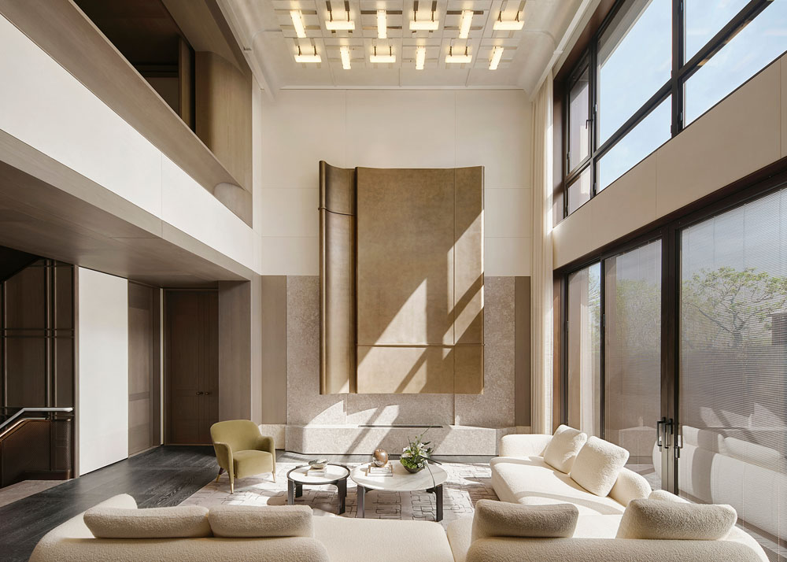 | 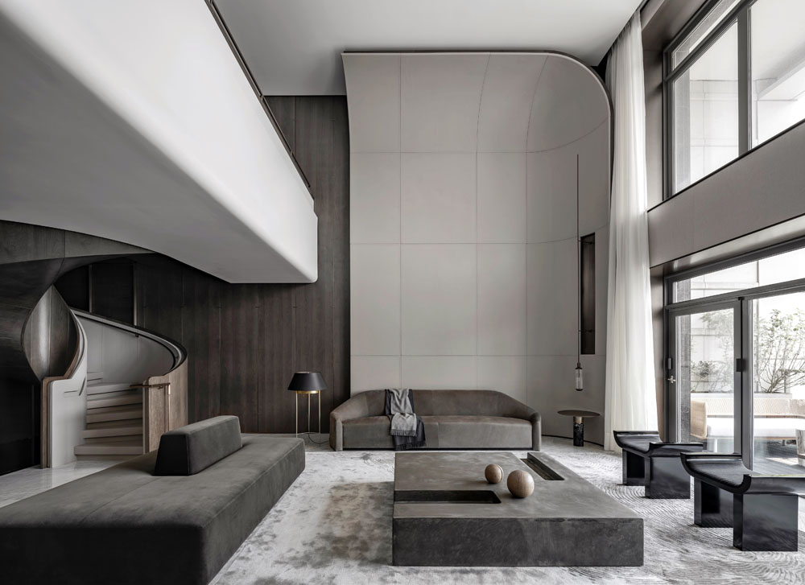 | 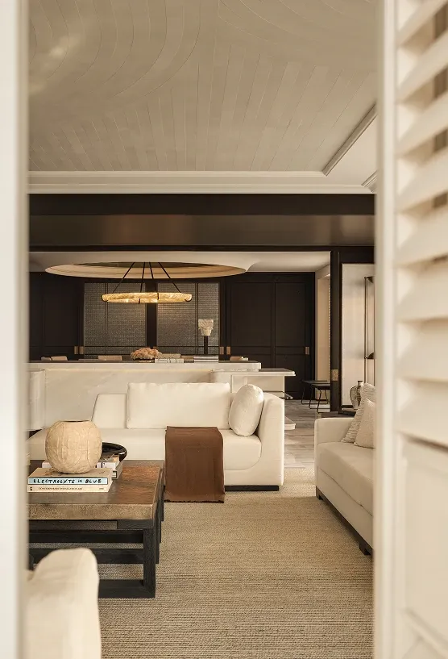 |

共同点不是具体家具，而是主次清楚、材质数量受控、留白帮助光线和观看。

## 2. 餐厨与聚合感

| W.DESIGN：门框递进与圆桌 | CCD：深木与浅石的餐厨对照 | CCD：普通住宅功能更强的浅木厨房 |
|---|---|---|
| 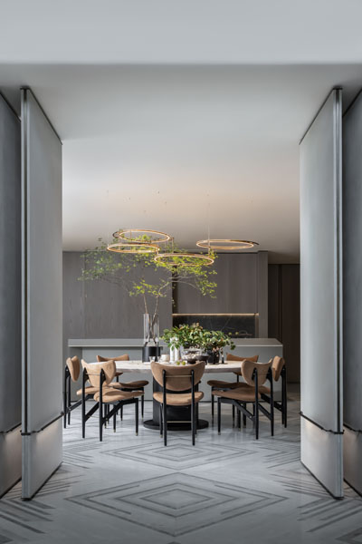 | 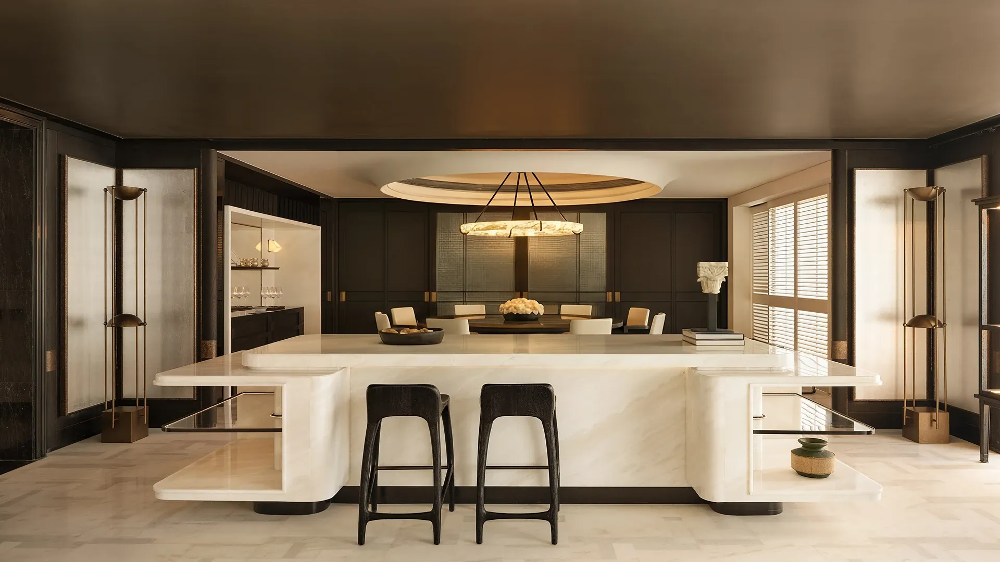 | 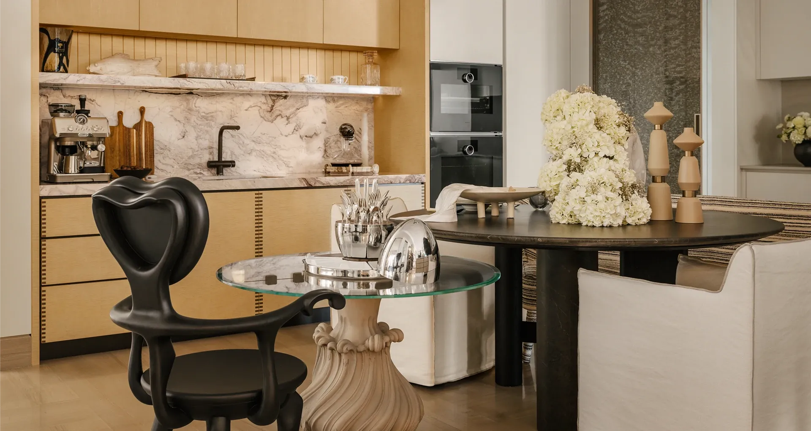 |

可提取规则是圆桌的聚合性、柜体完整性和深浅材质平衡；不可复制超大岛台或酒店式展示。

## 3. 卧室的安静与包裹感

| W.DESIGN：织物、浅木、自然 | CCD：深色框架与四柱床变体 | CCD：浅木、织物与非完全对称灯光 |
|---|---|---|
| 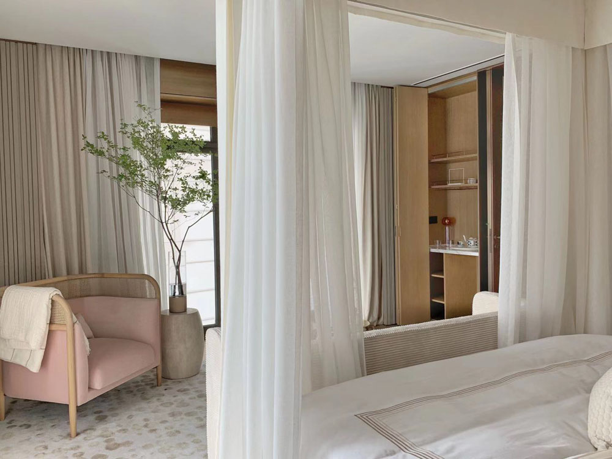 | 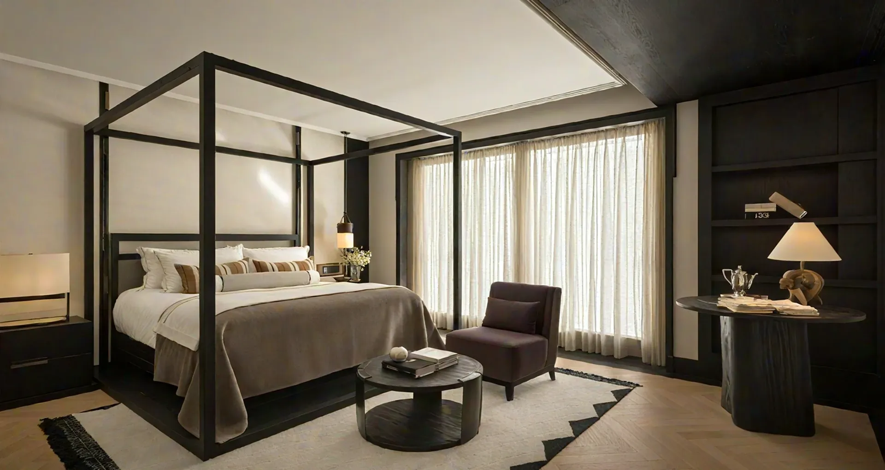 | 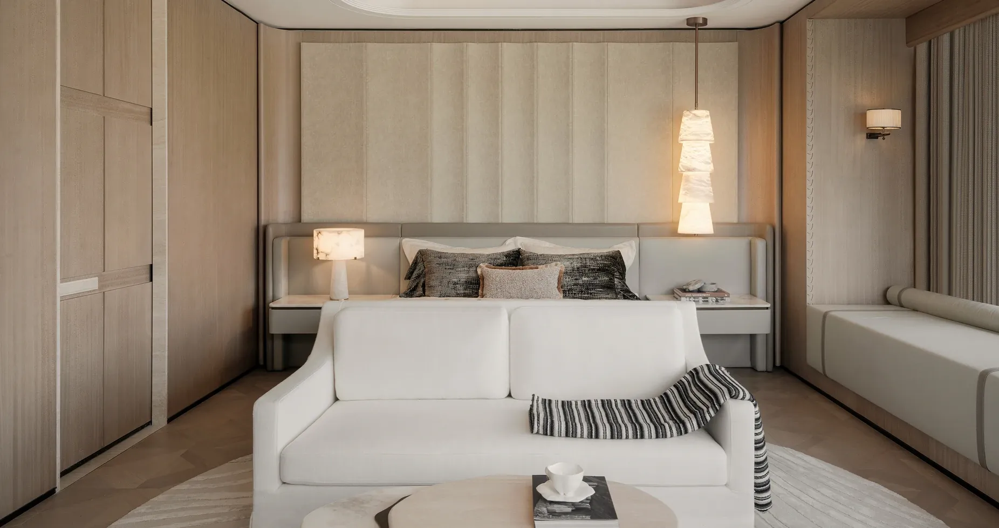 |

默认使用普通床架和整合式床头墙；四柱床仅在大卧室和明确偏好下启用。

## 4. 卫浴与半透明层次

| W.DESIGN：自然关系 | CCD：半透明屏风与暖光 | CCD：浅木柜体与实用收纳 |
|---|---|---|
| 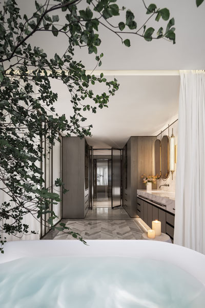 | 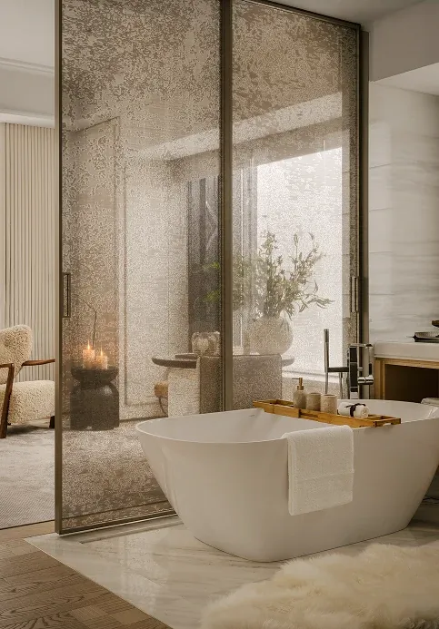 | 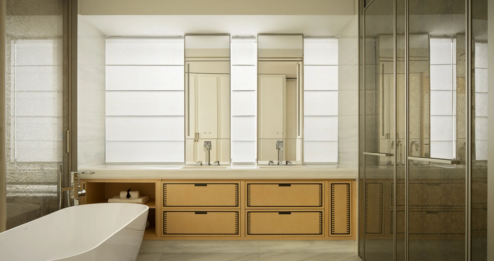 |

卫浴只提取材料、光和层次；洁具、排水、门窗与湿区边界必须由 Agent 保留。

## 5. 风格边界

- 不把“深木 + 大理石 + 黄铜”机械等同于 Modern East。
- 不把每个空间都做成黑白水墨画廊。
- 不把 CCD 的酒店经验原样移植到住宅。
- 不把屏风、圆桌、四柱床或室内树变成必选符号。
- 判断标准始终是：现代、克制、层次、自然、材料真实、能够居住。

