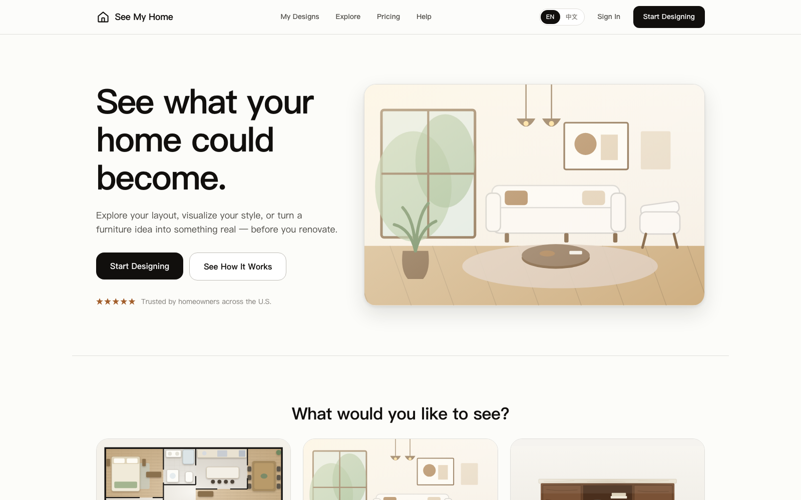
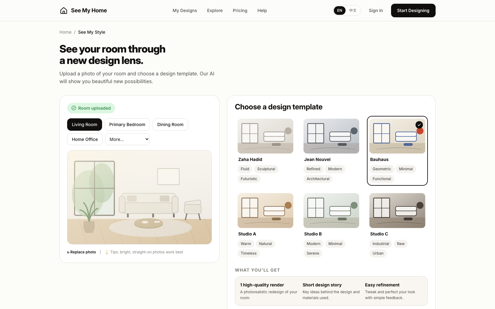

<div align="center">

# See My Home

**看见家的未来 · See what your home could become**

[English](README.md) · [**中文**](README.zh-CN.md)

    



</div>

---

## 概览

**See My Home** 是一个帮助业主在动工之前先"看见未来"的 Web SaaS Demo。它不向用户暴露 AI 工具,而是只问一个问题——*"你想先看到什么?"*——并把答案包装成三个引导式模板:

1. **看懂我的布局(See My Layout)** — 把黑白户型图变成带家具、一看就懂的家庭布局
2. **看见我的风格(See My Style)** — 上传真实房间,用全新的设计视角重新演绎它
3. **定制我的家具(Make My Furniture)** — 把手绘草图或灵感图变成逼真的定制家具设计

所有流程都在浏览器中端到端运行:分阶段的 AI 式生成、基于标签的确认、调整循环,以及按"家"组织的统一 **我的设计** 空间。界面顶部导航自带 **EN / 中文切换**(默认英文)。

Agent 层在清晰的 API 边界后完全模拟实现(`src/lib/agents.ts`)——将其内部替换为真实 Agent API 调用即可,无需改动任何 UI 组件。

<div align="center">

</div>

## 功能

- 🏠 **看懂我的布局** — 上传(或使用示例户型图)→ AI 房间识别 → 从标签库确认房间用途 → 生活方式标签("有什么需要特别考虑的吗?")→ 分阶段生成 → 家具化俯视户型图,含**设计 / 家具 / 动线 / 房间标签**四种视图、按选择定制的布局说明与关键决策
- 🎨 **看见我的风格** — 房间照片 + 房型 → 六个带风格标签的设计模板 → 效果图 + 简短设计说明 → 带快捷建议、Agent 回复与版本缩略图(原图 / 当前 / 各次调整)的调整循环
- 🪑 **定制我的家具** — 草图 + 灵感图 + 文字描述 → 产品级渲染 → 调整材质 / 尺寸 / 支脚 / 拉手 / 层板 → *"就是它了"* → 带尺寸的三视图与基础规格
- 🗂️ **我的设计** — 按项目分组的已保存设计,`localStorage` 持久化
- 🌐 **双语界面** — 所有文案、生成的布局说明、设计说明与标签均可在英文与中文之间切换,选择跨会话保留
- ✨ **参数化 SVG 结果图** — 户型图、渲染图与图纸全部由代码绘制,并响应你的实际选择(房间标签、生活方式标签、模板色板、材质);下载导出的是真实 SVG 文件
- 🧭 **一致的体验** — 统一的页面切换动效、滚动复位、以分阶段进度取代转圈加载、支持减弱动态效果

## 项目结构

```
see-my-home/
├── src/
│   ├── pages/             # 每个界面一个目录(home、layout-flow、style-flow、furniture、designs)
│   ├── components/
│   │   ├── layout/        # 站点框架:导航、面包屑、步骤条
│   │   ├── ui/            # 按钮、标签、生成遮罩
│   │   └── visuals/       # 参数化 SVG:家具化户型图、房间场景、家具渲染与图纸
│   ├── lib/agents.ts      # 模拟 Agent API 层(可替换为真实 HTTP 调用)
│   ├── i18n/              # 中英文字典 + 语言上下文
│   ├── store/             # zustand 状态(已保存设计持久化)
│   ├── data/              # 房间标签、生活方式标签、风格模板
│   └── styles/            # 设计令牌 + 全局样式
└── docs/                  # 截图
```

## 运行

```bash
npm install
npm run dev      # http://localhost:5173
```

```bash
npm test         # 单元测试(Vitest,29 个全部通过)
npm run build    # 生产构建(gzip 后约 100 kB)
```

## 本 Demo 不包含

真实 AI 生成、账号体系、分享链接后端、价格页、灵感页、CAD/BIM 工具——产品架构允许它们作为独立 Agent 接入现有 API 边界逐步扩展。
