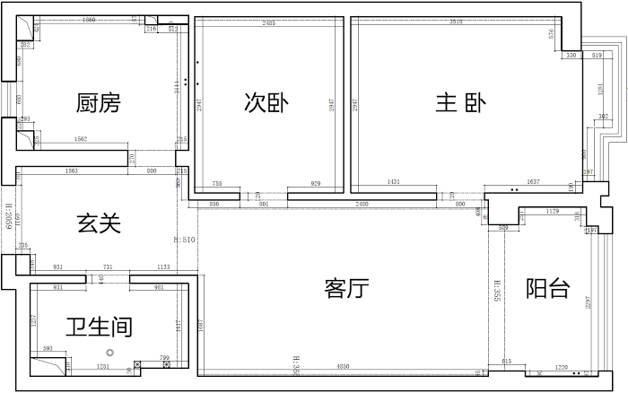
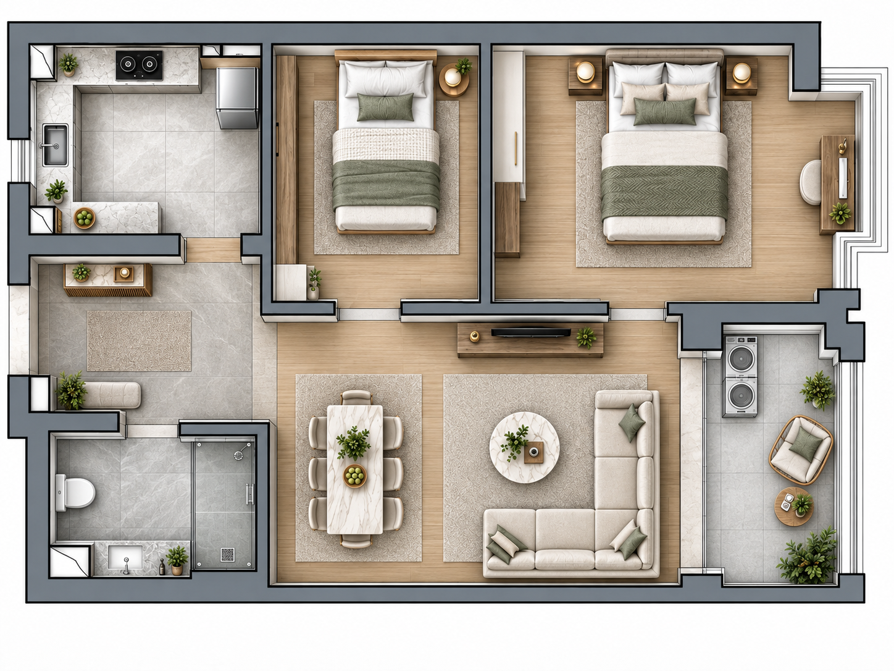
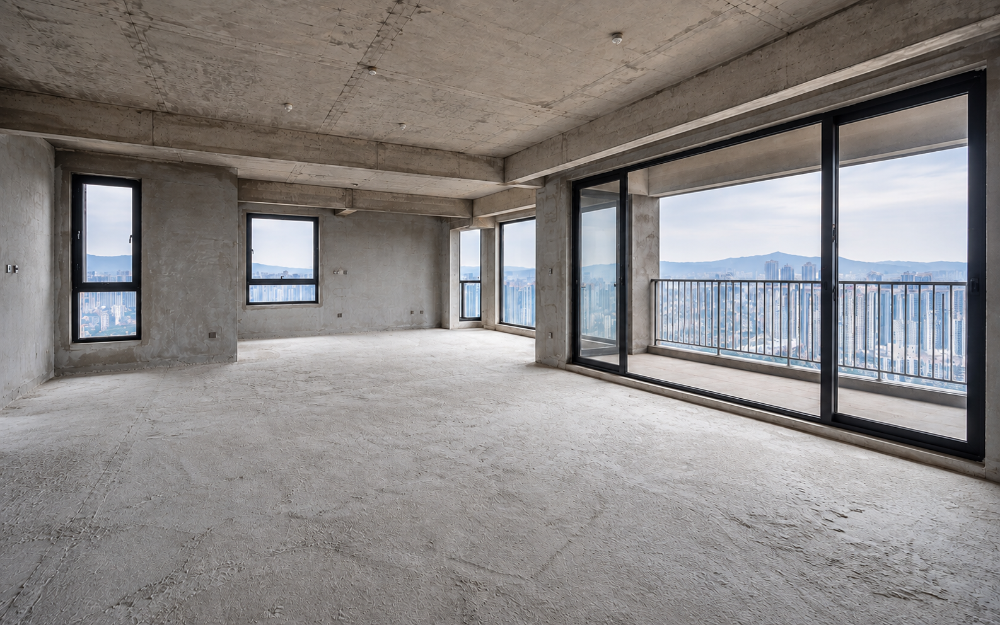
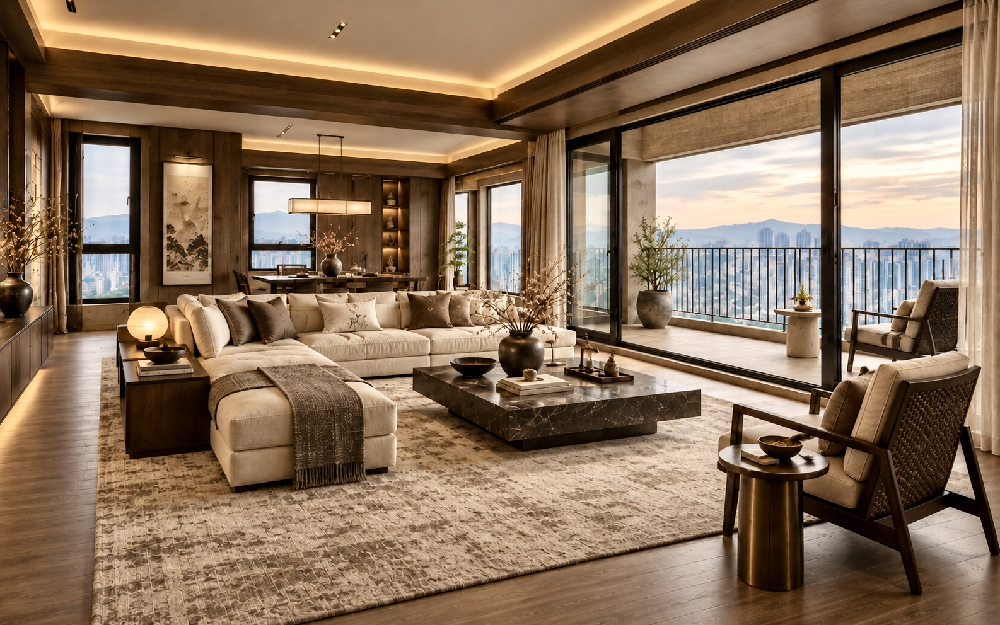
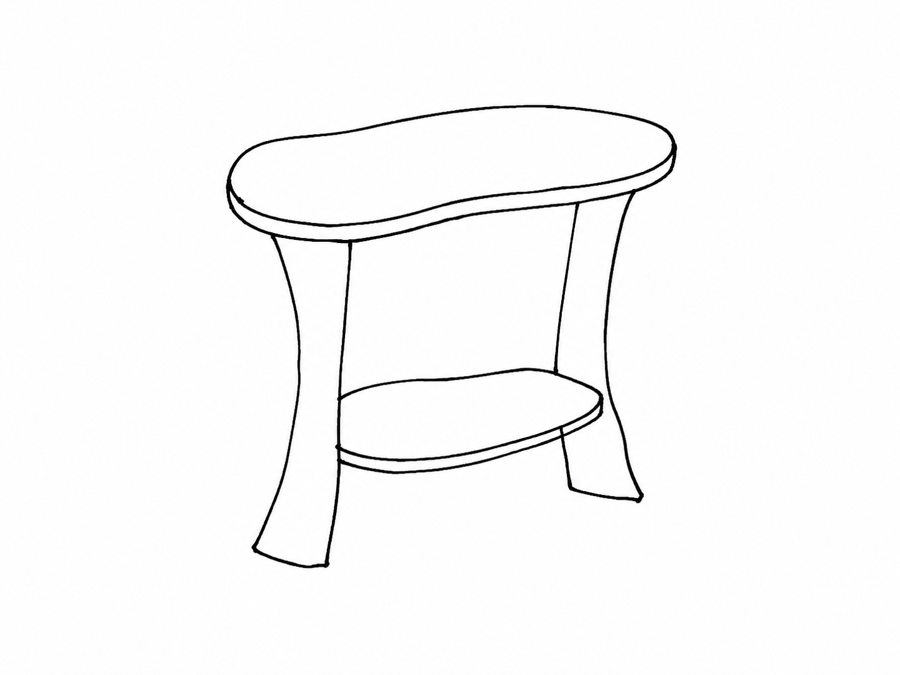
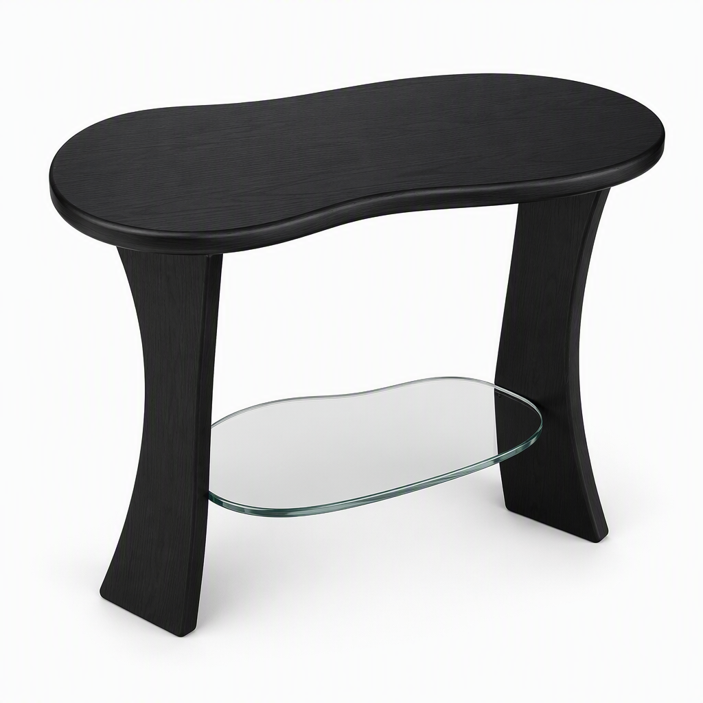
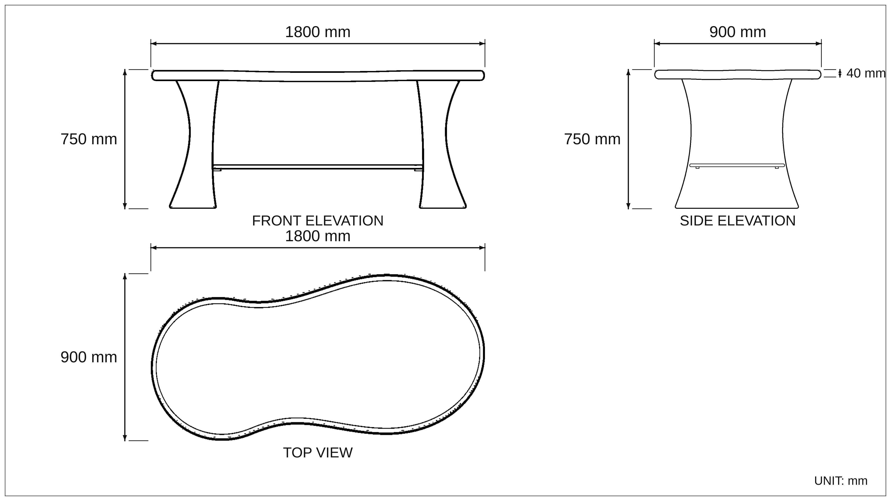

<div align="center">
  <h1>See My Home</h1>
  <h3>看见家，可以成为的样子。</h3>
  <p>面向独立室内设计师及其客户的 AI 家居设计可视化工作区。</p>
  <p><a href="./README.md">English</a> · <strong>中文</strong></p>
</div>

<p align="center">
  
</p>

## See My Home 是什么？

See My Home 把住宅设计项目前期最难沟通的三类问题——**空间怎么看、风格怎么选、家具怎么做**——转化成客户可以直接看、选、改的视觉方案。

产品不要求客户先读懂专业图纸，也不要求一次写出完整 Prompt，而是通过户型图、房间照片、参考图、标签、尺寸和引导式参数收集设计意图。三个独立的 AI Agent 再把这些信息转化为可用于沟通的视觉结果，帮助独立设计师更早确认方向，把更多时间留给真正需要专业判断的设计工作。

## 一套工作区，承接三个设计决策

| Agent | 用户要解决的问题 | 主要输入 | 主要输出 |
| --- | --- | --- | --- |
| **Home Layout** | “这个户型实际住起来会怎样？” | 黑白户型图、房间用途、家庭与生活需求 | 彩色家具化布局与空间判断 |
| **Home Style** | “这种风格放到我家是什么效果？” | 房间照片、风格预设或参考图、调整要求 | 保留原空间结构的风格效果图与设计说明 |
| **My Furniture** | “脑中的家具怎样变成可讨论的方案？” | 草图、灵感图、文字、尺寸和材料偏好 | 家具效果图、基础规格与带尺寸概念三视图 |

### Home Layout｜把建筑尺度翻译成生活尺度

Home Layout 将专业黑白户型图转化为带家具与材质的彩色俯视效果，帮助用户直观理解房间布局。在图片背后，它会识别房间与门窗、建立可持续修正的 Home Model、校准可确认的尺度，并规划家具、动线和材质分区；生成图用于呈现方案，但不会被当成真实建筑结构的依据。

<table>
  <tr>
    <td width="50%" align="center"><br /><sub>输入 · 原始户型图</sub></td>
    <td width="50%" align="center"><br /><sub>输出 · 彩色家具化布局</sub></td>
  </tr>
</table>

### Home Style｜让风格选择从形容词变成画面

Home Style 将选定风格直接应用到客户自己的房间中。它支持摩登东方、加州现代、极繁奢华，以及用户自带参考图的自定义路径；在重新组织材质、色彩、家具、灯光和氛围时，保留原有墙体、门窗、梁柱、相机位置和空间比例。客户不再只能说“温暖一点”或“高级但不要太冷”，而是可以直接比较不同方向落到自己家里的效果。

<table>
  <tr>
    <td width="50%" align="center"><br /><sub>输入 · 客户的真实空间</sub></td>
    <td width="50%" align="center"><br /><sub>输出 · 摩登东方设计方向</sub></td>
  </tr>
</table>

### My Furniture｜让家具灵感变成能讨论的方案

My Furniture 可以从简单手绘、灵感图片、文字描述，或几种输入的组合开始。它先把想法整理成结构化家具规格并生成概念效果图；方案确认后，再按照统一的尺寸基准生成正视、侧视和顶视图，为客户、设计师、供应商与工厂提供一套能够继续讨论、深化和打样的共同参考。

<table>
  <tr>
    <td width="33%" align="center"><br /><sub>输入 · 简单手绘</sub></td>
    <td width="33%" align="center"><br /><sub>输出 · 概念效果图</sub></td>
    <td width="33%" align="center"><br /><sub>输出 · 带尺寸概念三视图</sub></td>
  </tr>
</table>

> 家具图纸用于概念沟通，不是可以直接生产的施工图，也不构成结构或工程认证。

## 统一的产品流程

三个 Agent 共用同一套交互骨架：

```text
上传素材 → 确认关键信息 → 等待生成 → 查看与解释结果 → 调整、保存或下载
```

系统先通过图片、预设、标签和参数收集结构化信息，再把自由文本留给细节补充与后续调整。三个 Agent 共用一套 UI，但分别维护版本、契约、Skills 与测试，可以独立升级和部署。

## 系统架构

```text
See My Home Web UI
  → 独立的 /api/home-layout、/api/home-style、/api/home-furniture 路由
  → 对应的 ZooWork Managed Agent 与版本化 Skills
  → 经过验证并发布的视觉结果
```

- 浏览器不会获得 ZooWork API Key，也不会直接请求 ZooWork。
- 每个 Agent 分别拥有 Runtime Contract、API 命名空间、Agent ID、Skills、Schema 和测试。
- 私有上传文件和生成图片使用 Vercel Blob；Agent 只接收短期签名资源地址。
- [`agent-release.json`](./agent-release.json) 固定产品当前兼容的三个 Agent 版本。

完整运行时契约参见 [Agent 接入与发布规则](./docs/AGENT-INTEGRATION.md)。

## 本地运行

需要 Node.js 20 或更高版本，以及 pnpm。

```bash
pnpm install
pnpm check
pnpm test
pnpm build
pnpm dev
```

本地联调三个 ZooWork Runtime：

```bash
pnpm --dir Home-Layout-Agent test:local
pnpm --dir Home-Style-Agent runtime
pnpm --dir Home-Furniture-Agent runtime
```

将对应的 `.env.example` 复制为已被 Git 忽略的 `.env`，再填写自己的服务端凭据。不要在浏览器代码或 `VITE_*` 变量中暴露 ZooWork API Key。

## 仓库结构

```text
See-My-Home-Web/       React + Vite 产品界面
Home-Layout-Agent/     户型理解与布局可视化
Home-Style-Agent/      保留空间结构的室内风格生成
Home-Furniture-Agent/  家具规格、效果图与概念三视图
api/                   按 Agent 隔离的 Vercel 服务端适配层
agent-release.json     三个 Agent 的兼容版本组合
docs/                  产品、接入与部署文档
```
